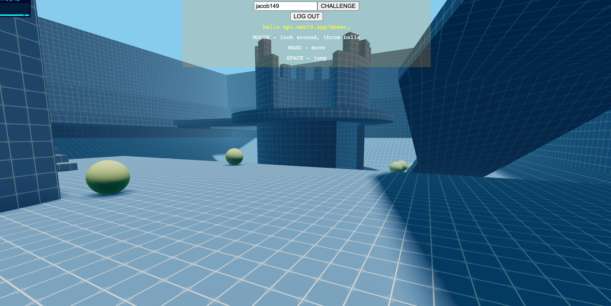

# First Person Shooter Dodgeball. 

Live game [here](https://abeer958.github.io/fps2.0/build/index.html)

## Table of Content
* General Information
* Technologies Used
* Features
* Screenshot
* Installation and Setup Instructions
* Usage
* Project Status
* Room for Improvement
* Acknowledgements
* Contact

## General Information

A PG13 dodgeball first person shooter (fps) game. This game is built using ReactJS, and Three.JS a Javascript 3D library.

### Purpose of this project

To build a 3D multiplayer game in collaboration with other developers.

## Technologies Used
* ReactJS
* Three.JS
* HTML
* CSS
* JavaScript

## Features
* Auth Login.
* Multiplayer game.
* 3D Design.

## Screenshot
Version 1.0 

## Installation and Setup Instructions

Clone down this repository. You will need node and `npm` installed globally on your machine.

### Installation:

`npm install`

To Run Test Suite:

`npm test`

To Start Server:

`npm start`

To Visit App:

`localhost:3000/`

## Usage

**Sign Up/ Login**

* Join web10 a decentralized cloud platform.

**Play Game**

* Play dodgeball with other players.

## Project Status
Project is: In progress 

## Room for Improvement
* Add UI with ReactJS.
* Add settings that allow for character adjustments (e.g. skins).

## Acknowledgements
* Many thanks to Jacob149.

## Contact
- Abeer Ahmed [LinkedIn profile](add url) - feel free to contact me.
- @Jacob149 on Github.

